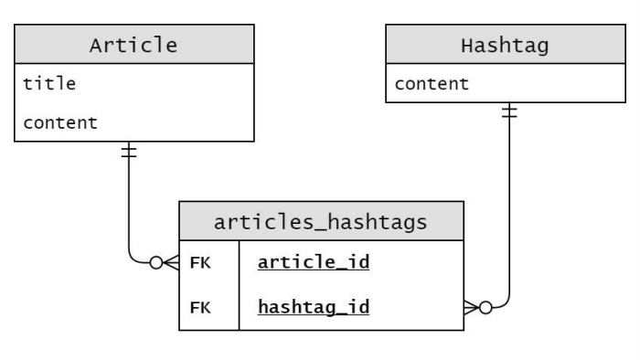

## WorkShop 25

> Article의 Hashtag를 구현하기 위하여 아래와 같이 개체-관계 다이어그램을 작성한 것이다. 다이어그램을 바탕으로 models.py에 Article 모델과 Hashtag 모델을 작성하시오.



```python
from django.db import models

class Hashtag(modes.Model):
    content = models.CharField(max_length=30)
    
class Article(models.Model):
    title = models.CharField(max_length=30)
    content = models.TextField()
    articles_hashtags = models.ManyToManyField(
    	Hashtag,
    	blank=True)
```

