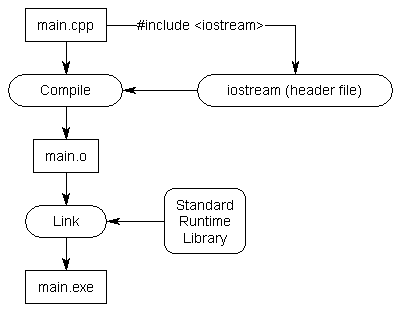
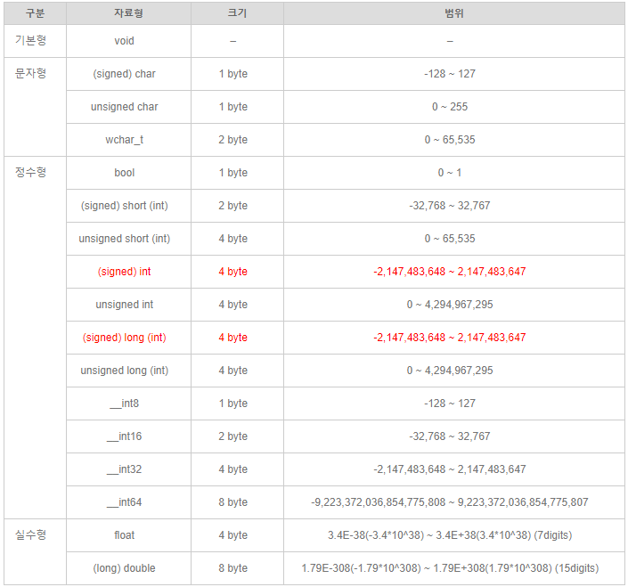
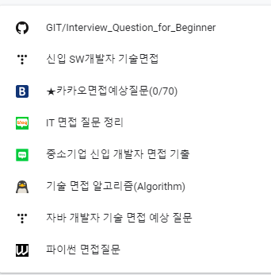
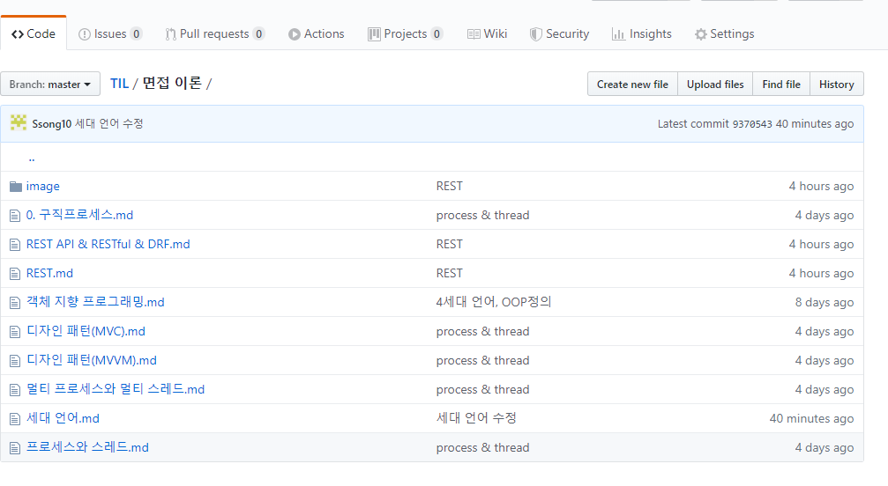

# C++ 기본


## Visual Studio

* Visual Studio C++ 파일 기본 구조
  * 솔루션 - > 프로젝트 -> 소스 파일 (`.cpp`) 형태로 구성이 되어있다.
  * `.cpp` 파일의 `main()` 함수에서 `exe` 파일을 동작시키며,  하나의 솔루션에서 하나의 `main()` 함수를 동작한다
  * 소스파일에 여러개의 `.cpp` 가 있는 경우 `속성` - `일반` - `빌드에서 제외`  -> `( 예 )` 선택으로 main()함수 read를 못하게 한다
  
  * 표준 입출력 사용시 (`scanf` 사용하기 위하여 소스파일의 `SDL 검사` 을 `아니요` 로 선택한다.)

## C++

### 파이썬과 차이점

* 함수를 사용하는 데에 있어서 접근방식은 python 과 비슷하나, 인덱싱 접근, 주소값 접근등 1차원적인 접근을 통하여 속도가 빠르고 가볍다.
* python이 재사용성이나 숏코딩면에서 압도적이긴 하지만 시스템적인 프로그래밍 언어는 C / C++ 이기 때문에 기본 구성이나 구현 스타일을 알게 된다면 코딩을 하는 데 도움이 될 것이라고 생각된다

### 헤더파일
> #include <stdio.h>
>
> #include <iostream>



#### stdio.h

* stdio : Standard input and ouput , C언어에서 입,출력과 관련된 헤더파일 
  * `printf()`, `fprintf()`, `fopen` ,,etc

* stdio.h : stdio 와 기능상의 차이는 없으나 namespace 사용법이 약간 다름
  * stdio.h 사용시 `using namespace std;` 

#### iostream

* 입출력을 수행하기 위한 모든 C++ 스트림들을 포함한 헤더파일
* type-safe : 컴파일러가 I/O 되는 객체의 형식을 static 하게 알 수 있습니다
* 확장성 : iostream 은 기존의 코드를 바꾸지 않고 유저가 정의한 타입을 I/O할 수 있습니다.

### STL

> standard Template Library

Container(자료구조) , Iterator(반복자), Alogorithm(알고리즘) 으로 구분

#### Pair

\- pair를 사용하면 두 자료형 T1과 T2를 묶을 수 있음

\- 첫번째 자료는 first , 두번째 자료는 second로 접근!

\- make_pair() 를 통해 만들 수 있다

\- #include <algorithm> or #include <vector>

#### Vector

\- vector 컨테이너는 대표적인 시퀀스 컨테이너로 배열과 비슷하여 자주 사용함

\- 길이를 변경 할 수 있는 배열

\- vector <vector<int>>  v 로 선언하여 2차원 배열로 사용 가능

\- v.push_back()    // data 추가

\- v.pop_back()     // data 삭제

\- v.clear()        // 벡터 초기화

\- v.size()         // 벡터의 크기

\- v.empty()       // 벡터가 비었는지 확인 ( true or false )

\- v.front()        // 벡터의 첫번째 원소

\- v.back()        // 벡터의 마지막 원소

\- v.insert(v.begin(), 5, 0)    // vector의 첫번째원소 앞에 0을 5개 삽입

\- v.erase(v.begin()+2)      // vector의 첫번째원소에서 2만큼 옆에 있는 원소를 삭제

### 자료형



### 서식 문자

`%d` - int - 부호 있는 10진수 정수

`%f` - float, double - 10진수 방식의 부동소수점 실수

`%c` - char - 값에 대응하는 문자

`%s` - char - 문자열


### 문법

#### 기본 입출력

```c++
// 입력값
using namespace std;
int N;
cin >> a;

scanf("%d",&N);
// N의 주소값에 %d 형태로 값을 넣어주게 된다
```

```c++
// 출력
using namespace std;
int N = 10;
cout << N;

printf("%d", N);
```


#### 기본적인 반복문 사용

  ```c++
  for (a; b; c) {
      // 반복할 코드
  }
  형태로 사용되게 됩니다
  a 에는 초기식 , b에는 조건식 , c에는 변화식
  a에서 초기값을 통하여 반복을 시작하게 되고, b의 조건이 맞을 때 반복할 코드를 한 번 동작하고 c가 실행이 됩니다.
  ```

  

#### 동적 할당,

```c++
int N;
scanf("%d", &N);

int *arr = new int[N];
// arr 포인터를 생성하게 되고 그에 대한 10개의 배열을 새로 할당하여 
// int arr[10] 과 같은 형태의 동적할당이 되었다.
```


```c++
int N ;
scanf("%d",&N);

int **arr = new int*[N];
for (int i=0;i<N;i++){
	arr[i] = new int[N] {0, };
}
// 배열 인덱스 하나 마다 새로운 동적할당으로 N개의 0값으로 초기화된 배열을 가지게 된다
/* scan 값으로 3을 받게 된다면,
결과는
{{0, 0, 0},
{0, 0, 0},
{0, 0, 0}} 형태의 배열
*/
```


## 알고리즘

### 백트래킹
1. [N과 M(1)](https://www.acmicpc.net/problem/15649)
    ```c++
    #include <iostream>
    using namespace std;
    int N, M;
    bool visit[9] = { false, };
    int result[8] = { 0, };
    // 백트레킹 함수
    void back(int count) {
     if (count == M) {
         for (int i = 0; i < count; i++) cout << result[i] << ' ';
         cout << '\n';
         return;
     }
     else {
         for (int i = 1; i <= N; i++) {
             if (!visit[i]) {
                 visit[i] = true;
                 result[count] = i;
                 back(count + 1);
                 visit[i] = false;
             }
         }
     }
    }
    int main(void) {
     cin >> N >> M;
     int count = 0;
     back(count);
     return 0;
    }
    ```


### 브루트 포스
   1. [한수]()
      ```c++
      #include <iostream>
      
      using namespace std;
      
      int N;
      int n1, n2, n3, n4;
      
      int bf(int num) {
        int answer = 99;
        if (num < 100) {
            answer = num;
        }
        else if (num > 100) {
            if (num == 1000) num = 999;
            for (int i = 100; i <= num; i++) {
                n1 = i % 10;
                n2 = i / 10 % 10;
                n3 = i / 100;
                if (n1 - n2 == n2 - n3) answer++;
            }
        }
        return answer;
      }
      
      int main() {
        cin >> N;
        int result = bf(N);
        cout << result;
        return 0;
      }
      ```

###  BFS와 DFS

```c++
#include<iostream>
#include<vector>
#include<queue>
#include<algorithm>
using namespace std;

vector<int> v[1001];
bool d_check[1001];
bool b_check[1001];
int n, m, p;
void dfs(int p)
{
	d_check[p] = true;
	cout << p << ' ';
	for (int i = 0; i<v[p].size(); i++)
	{
		if (!d_check[v[p][i]])
			dfs(v[p][i]);
	}
}
void bfs(int p)
{
	queue<int> q;
	q.push(p);
	b_check[p] = true;
	while (q.size())
	{
		int cur = q.front(); 
		q.pop();
		cout << cur<<' ';
		for (int i = 0; i < v[cur].size(); i++)
		{
			if (!b_check[v[cur][i]])
			{
				b_check[v[cur][i]] = true;
				q.push(v[cur][i]);
			}
		}
	}
}
int main()
{
	cin >> n >> m>> p;
	for (int i = 0;i < m; i++)
	{
		int to, from;
		cin >> to >> from;
		v[to].push_back(from);
		v[from].push_back(to);
	}
    
	for (int i = 1; i <= n; i++)
		sort(v[i].begin(), v[i].end());
	// 다음 노드를 정해주기 위해서 정렬을 해준다
    
    dfs(p);
	cout << '\n';
	bfs(p);
	return 0;
}
```

### DP ( 퇴사)

```c++
#include <iostream>

int main()
{
	int N, T, P;
	scanf("%d", &N);
	int* arr = new int[N + 1]{ 0, };
	for (int i = 0; i < N + 1; i++) {
		scanf("%d %d", &T, &P);
		if (arr[i] < arr[i - 1]) {
			arr[i] = arr[i - 1];
		}
		if (i + T <= N); {
			if (arr[i + T] < arr[i] + P) {
				arr[i + T] = arr[i] + P;
			}
		}
	}
	printf("%d", arr[N]);
}
```


# 기술면접 대비

> 기술면접에 대비하기 위하여 CS (운영체제, 개발상식, 디자인패턴), Language 등 용어 정리


## 개요

1. 구글링 `면접` 키워드 북마크 등록



2. `Markdown`으로 정리하여 `Git` 에 정리

   

[면접 Git]([https://github.com/Ssong10/TIL/tree/master/%EB%A9%B4%EC%A0%91%20%EC%9D%B4%EB%A1%A0](https://github.com/Ssong10/TIL/tree/master/면접 이론)) 에 정리하여 면접보기 전에 찾ㄴ기 편하게 !!


## 세대언어

* 1세대 언어 - 기계어
* 2세대 언어 - 어셈블리어

* 3세대 언어 - 컴파일러
* 4세대 언어 - PL/SQL, visual C++
  * PL - procedural programming (절차적 프로그래밍)
  * SQL - Structured Query Language , 구조화질의어

## 프로세스

> 컴퓨터에서 연속적으로 실행되고 있는 컴퓨터 프로그램
>
> 메모리에 올라와 실행되고 있는 프로그램의 인스턴스(독립적인 개체)
>
> 운영체제로부터 시스템 자원을 할당받는 작업의 단위
>
> 즉, 동적인 개념으로는 실행된 프로그램을 의미한다.

## 스레드(Thread)

> 프로세스 내에서 실행되는 여러 흐름의 단위
>
> 프로세스의 특정한 수행경로, 할당받은 자원을 이용하는 실행의 단위

* 스레드는 프로세스 내에서 각각 Stack만 따로 할당받고 Code, Data, Heap 영역은 공유한다.
* 스레드는 한 프로세스 내에서 동작되는 여러 실행의 흐름으로, 프로세스 내의 주소 공간이나 자원들(힙 공간 등)을 같은 프로세스 내에 스레드끼리 공유하면서 실행된다.
* 같은 프로세스 안에 있는 여러 스레드들은 같은 힙 공간을 공유한다. 반면에 프로세스는 다른 프로세스의 메모리에 직접 접근할 수 없다.


## 객체 지향 프로그래밍

> OOP : Object Oriented programming

객체 지향 프로그래밍(이하 OOP)는 컴퓨터 프로그램을 “객체(Object)"들의 모임으로 파악하고자 하는 프로그래밍의 패러다임 중에 하나이다. 각 “객체(Object)" 들은 서로 메시지를 주고 받을 수 있으며 데이터를 처리할 수 있다

* 특성

  * **응집력(cohesion)** : 프로그램의 한 요소가 해당 기능을 수행하기 위해 얼마만큼의 연관된 책임과 아이디어가 뭉쳐있는지를 나타내는 정도

  * **결합력(coupling)** : 프로그램 코드의 한 요소가 다른 것과 얼마나 강력하게 연결되어 있는지, 얼마나 의존적인지를 나타내는 정도

* 특징

  * 캡슐화
    * 캡슐화는 객체의 데이터를 외부에서 직접 접근하지 못하게 막고, 함수를 통해서만 조작이 가능하게 하는 작업이다.
  * 추상화
    * 추상화는 객체들이 가진 공통의 특성들을 파악하고 불필요한 특성들을 제거하는 과정을 말한다. 
  * 상속
    * 유지 보수, 개발단계에서의 편의성을 위해 상속을 통해 중복문제를 해결 한다.

  * 다형성
    * 형태가 같은데 다른 기능을 하는 것을 의미한다, 상속을 통하여 오버라이딩한다.

## 디자인 패턴

> 프로그램이나 어떤 특정한 것을 개발하는 중에 발생했던 문제점들을 정리해서 상황에 따라 간편하게 적용해서 쓸 수 있는 것을 정리하여 특정한 `규약` 을 통해 쉽게 쓸 수 있는 형태로 만든 것

### 1. MVC

* M : Model 

  * 애플리케이션의 정보, 데이타를 나타냅니다. 데이타베이스, 처음의 정의하는 상수, 초기화값, 변수 등을 뜻합니다. 또한 이러한 DATA, 정보들의 가공을 책임지는 컴포넌트를 말합니다.

  1.  사용자가 편집하길 원하는 모든 데이터를 가지고 있어야 한다
  2.  뷰나 컨트롤러에 대해서 어떤 정보도 알지 말아야 한다.
  3.  변경이 일어나면, 변경 통지에 대한 처리방법을 구현해야만 한다.

* V : View

  * input 텍스트, 체크박스 항목 등과 같은 사용자 인터페이스 요소를 나타냅니다. 다시 말해 데이터 및 객체의 입력, 그리고 보여주는 출력을 담당합니다. 데이타를 기반으로 사용자들이 볼 수 있는 화면입니다.  

  1. 모델이 가지고 있는 정보를 따로 저장해서는 안된다.
  2. 모델이나 컨트롤러와 같이 다른 구성요소들을 몰라야 된다.
  3. 변경이 일어나면 변경통지에 대한 처리방법을 구현해야만 한다.

* C: controller

  * 데이터와 사용자인터페이스 요소들을 잇는 다리역할을 합니다. 

    즉, 사용자가 데이터를 클릭하고, 수정하는 것에 대한 "이벤트"들을 처리하는 부분을 뜻합니다.

  1. 모델이나 뷰에 대해서 알고 있어야 한다.
  2. 모델이나 뷰의 변경을 모니터링 해야한다. (메인 로직)

### 2. MTV

* Django - MVC 패턴이지만 명명을 달리하여 MTV 패턴으로 사용을 한다.

  > model - model
  >
  > view 를 template, 사용자에게 보여지는 부분을 ,
  >
  > controller 는 View, 실직적인 프로그램 로직이 동작하여 데이터를 가져오고 가공해서 template에 전달하는 역할을 수행한다.

  


### 2. MVVM

* Model : 어플리케이션에 사용되는 데이터와 그 데이터를 처리하는 부분입니다.

* View : 사용자에서 보여지는 UI부분입니다

* View Model : View를 표현하기 위해 만든 View를 위한 Model 입니다. View를 나타내 주기 위한 Model 이자 View를 나타내기 위한 데이터 처리를 하는 부분입니다

* 장점

  > MVVM 패턴은 View와 Model 사이의 의존성이 없습니다. 또한 Command 패턴과 Data Binding을 사용하여 View와 View Model 사이의 의존성 또한 없앤 디자인패턴입니다. 각각의 부분은 독립적이기 때문에 모듈화 하여 개발할 수 있습니다.


## REST

###  REST의 정의

* Representational State Transfer 의 약자
* 자원의 이름으로 구분하여 해당 자원의 상태를 주고 받는 모든것
* www 과 같은 분산 하이퍼미디어 시스템을 위한 소프트웨어 개발 아키텍처의 한 형식

### REST 특징

1. Server-Client(서버-클라이언트 구조)
   * 자원이 있는 쪽이 Server, 자원을 요청하는 쪽이 Client가 된다
     * REST Server : API를 제공하고 비즈니스 로직 처리 및 저장을 책임진다
     * Client : 사용자 인증이나 Context(세션, 로그인 정보) 등을 직접 관리하고 책임진다
   * 서로 간의 의존성이 줄어든다

2. Stateless(무상태)
   * HTTP 프로토콜은 Stateless Protocol 이므로 REST 역시 무상태성을 갖는다.
   * Client 의 context 를 Server에 저장하지 않는다
   * Server는 각각의 요청을 완전히 별개의 것으로 인식하고 처리한다
3. Cacheable(캐시 처리 가능)
   * 웹 표준 HTTP프로토콜을 그대로 사용하므로 웹에서 사용하는 기존의 인프라를 그대로 활용할 수 있다. 
     * HTTP가 가진 가장 강력한 기능 중 하나인 캐싱 기능을 적용할 수 있다
   * 대량의 요청을 효율적으로 처리하기 위해 캐시가 요구된다
   * 캐시 사용을 통해 응답시간이 빨라지고 REST Server 트랜잭션이 발생하지 않기 때문에 전체 응답시간, 성능, 서버의 자원 이용률을 향상시킬 수 있다.
4. Layered System(계층화)
   * Client 는 REST API Server만 호출한다.
   * REST Server 는 다중 계층으로 구성될 수 있다.
   * PROXY, 게이트웨이 같은 네트워크 기반의 중간 매체를 사용할 수 있다.
5. Uniform Interface(인터페이스 일관성)
   * URI 로 지정한 Resource에 대한 조작을 통일되고 한정적인 인터페이스로 수행한다.
   * HTTP 표준 프로토콜에 따르는 모든 플랫폼에서 사용 가능하다

### REST API

* API(Application Programming Interface)란
  * 데이터와 기능의 집합을 제공하여 컴퓨터 프로그램간 상호작용을 촉진하며, 서로 정보를 교환가능 하도록 하는 것
* REST API의 정의
  * REST 기반으로 서비스 API를 구현한 것
  * 최근 OpenAPI(누구나 사용할 수 있도록 공개된 API: 구글 맵, 공공 데이터 등), 마이크로 서비스(하나의 큰 애플리케이션을 여러 개의 작은 애플리케이션으로 쪼개어 변경과 조합이 가능하도록 만든 아키텍처) 등을 제공하는 업체 대부분은 REST API를 제공한다.

### REST API의 특징

* 사내 시스템들도 REST 기반으로 시스템을 분산해 확장성과 재사용성을 높여 유지보수 및 운용을 편리하게 할 수 있다.
* REST는 HTTP 표준을 기반으로 구현하므로, HTTP를 지원하는 프로그램 언어로 클라이언트, 서버를 구현할 수 있다.
* 즉, REST API를 제작하면 델파이 클라이언트 뿐 아니라, 자바, C#, 웹 등을 이용해 클라이언트를 제작할 수 있다.

## RESTful

### RESTful이란

* RESTful은 일반적으로 REST라는 아키텍처를 구현하는 웹 서비스를 나타내기 위해 사용되는 용어이다

### RESTful의 목적

* 이해하기 쉽고 사용하기 쉬운 REST API를 만드는 것
* RESTful한 API를 구현하는 근본적인 목적이 성능 향상에 있는 것이 아니라 일관적인 컨벤션을 통한 API의 이해도 및 호환성을 높이는 것이 주 동기이니, 성능이 중요한 상황에서는 굳이 RESTful한 API를 구현할 필요는 없다.